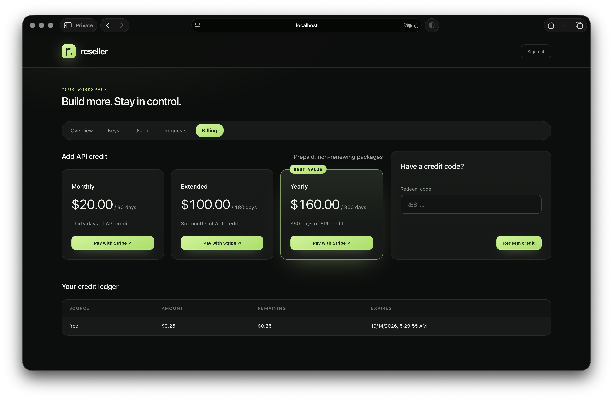

<p align="center">
  
</p>

# reseller

**Your API. Your pricing. One binary.**

A self-hosted, OpenAI-compatible API reseller platform written in Rust. Proxy language, text-to-speech, and speech-to-text requests; issue customer keys; meter usage; sell prepaid credit; and manage everything from an embedded web workspace.

- Streaming JSON, SSE, audio, multipart uploads, and WebSocket transport
- Separate LLM / TTS / STT upstreams, model policies, and fallback chains
- Self-service accounts, shared balances, key rotation, model allowlists, and usage limits
- Integer micro-USD accounting, expiring credit lots, markup overrides, and debt tracking
- Prepaid plans, single-use redeem codes, and Stripe Checkout with verified, idempotent webhooks
- Customer and administrator dashboards, request history, usage charts, live statistics API
- SQLite WAL with ordered migrations; no external database or frontend build required
- Non-root Docker image for AMD64 and ARM64

## Screenshots

Customer workspace — choose a plan, redeem a credit code, and follow the credit ledger:



## Install and run

Once the first release has been published to crates.io:

```sh
cargo install reseller --locked
reseller init
# Edit reseller.toml: set [llm].api_key and your upstream URL/model.
reseller
```

From this checkout, before publication:

```sh
cargo install --path . --locked
reseller init
reseller
```

Or bootstrap from environment variables:

```sh
OPENAI_BASE_URL=https://openrouter.ai/api/v1 \
OPENAI_API_KEY=sk-or-v1-... \
OPENAI_MODEL=your-model \
reseller
```

On first startup, an administrator token is generated and printed if none was supplied. **Save it.** Open:

| Page | URL |
|---|---|
| Landing / create key | `http://localhost:56787/` |
| Customer workspace | `http://localhost:56787/workspace/` |
| Administrator console | `http://localhost:56787/admin/` |
| OpenAI-compatible base URL | `http://localhost:56787/v1` |
| Liveness / readiness | `/healthz` / `/readyz` |

`reseller --help` lists all options. The default database is `.reseller/reseller.db` relative to the working directory. Rust 1.98+ is required to build.

```sh
reseller --host 127.0.0.1 --port 8080
reseller --database /srv/reseller/reseller.db serve
reseller doctor
reseller token                         # generate a new random token
reseller backup ./reseller-backup.db   # online SQLite snapshot
reseller reset-admin                   # stop the server first; then restart
reseller healthcheck                   # probe the local /readyz (container health check)
```

## Docker / GitHub Container Registry

After a release publishes the image:

```sh
docker run -d --name reseller --restart unless-stopped \
  -p 56787:56787 \
  -e OPENAI_BASE_URL=https://openrouter.ai/api/v1 \
  -e OPENAI_API_KEY=sk-or-v1-... \
  -e OPENAI_MODEL=your-model \
  -e PUBLIC_URL=https://api.example.com \
  -v reseller-data:/data \
  ghcr.io/reseller-rs/reseller:latest

docker logs reseller  # first-start administrator token
```

Or use `docker compose up -d`. Environment substitution is supported through your shell or a Compose `.env` file. Pin a release tag instead of `latest` for controlled upgrades.

Build locally with `docker build -t reseller:local .`. The release binary is a static musl build compiled with size-first release settings (`opt-level = "z"`, fat LTO, one codegen unit, `panic = "abort"`, stripped), and the runtime image is `scratch` plus the binary, the CA bundle, and an empty writable `/data` — no shell, no curl, no package manager. The image runs as UID/GID `10001`, uses `/data/reseller.db`, and its healthcheck invokes `reseller healthcheck`, which probes the local `/readyz` over TCP. Bind-mounted directories must be writable by that UID. Keep the data volume across upgrades. Allow up to the upstream timeout for graceful shutdown.

## Configuration

`reseller init` creates a starter TOML file with private permissions. It documents every setting; optional settings are commented out with their defaults. On **first start only**, TOML and bootstrap environment variables seed SQLite. Afterwards **Admin → Settings** is authoritative. Environment/file edits do not override an existing database.

Always-runtime options: `HOST`, `PORT`, `DB_FILE`, `RESELLER_CONFIG`, `RUST_LOG`, and corresponding CLI flags. The application does not automatically read `.env` files.

Supported bootstrap variables:

```text
OPENAI_BASE_URL / OPENAI_API_KEY / OPENAI_MODEL / OPENAI_MODEL_FALLBACKS
TTS_BASE_URL    / TTS_API_KEY    / TTS_MODEL    / TTS_MODEL_FALLBACKS / TTS_VOICE
STT_BASE_URL    / STT_API_KEY    / STT_MODEL    / STT_MODEL_FALLBACKS
ADMIN_TOKEN / KEY_PEPPER / MARKUP_PCT / FREE_CREDIT_USD
PUBLIC_URL / STRIPE_SECRET_KEY / STRIPE_WEBHOOK_SECRET
```

Fallback lists are comma-separated. Each upstream is configured independently. Set TTS/STT keys if you use audio routes. `public_url` controls dashboard links and payment redirects; set it to the externally reachable origin.

Settings include `model_policy` and `voice_policy` (`default`, `force`, `passthrough`), body limits, timeout, CORS, key-creation limits, default per-key limits, retention, prices, and payment secrets. CORS changes take effect after restart; other settings apply to new requests. Secrets are redacted in API responses; blank secret fields preserve the current value. Changing the key pepper invalidates all customer credentials and unredeemed codes.

Use decimal **strings** for prices, percentages, and spend-limit amounts:

```json
{
  "markup_pct": "30",
  "prices": {
    "default": { "input": "0.5", "output": "1.5", "audio_second": "0" },
    "my-tts-model": { "input": "0", "output": "0", "audio_second": "0.001" }
  },
  "default_limits": {
    "rpm": 60,
    "requests": { "max": 2000, "window_hours": 24 },
    "tokens": { "max": 1000000, "window_hours": 720 },
    "spend": { "max_usd": "5", "window_hours": 720 },
    "max_children": 2,
    "allowed_models": []
  }
}
```

Price-table input/output rates are USD per million tokens; audio rates are USD per second. Management endpoints also accept numeric USD amounts for grants/plans/codes. Responses expose money as decimal strings and timestamps as Unix seconds. Expiry inputs accept Unix seconds or RFC3339.

## Proxying

```sh
curl http://localhost:56787/v1/keys \
  -H 'Content-Type: application/json' \
  -d '{"name":"my-app","contact":"me@example.com"}'

curl http://localhost:56787/v1/chat/completions \
  -H "Authorization: Bearer $RESELLER_KEY" \
  -H 'Content-Type: application/json' \
  -d '{"model":"your-model","messages":[{"role":"user","content":"Hello"}],"stream":true}'
```

Omit `model` to use the configured `[llm].model` under `model_policy = "default"`. `passthrough` forwards the client's value unchanged (a wrong model fails upstream), and `force` always uses the configured model. Fallbacks only apply when the final model equals `[llm].model`.

The API key and dashboard token are shown only once and stored as HMAC-SHA256 hashes. Dashboard tokens manage accounts but **cannot call the proxy**. Blocked API keys retain workspace access; revoked credentials do not. All keys on an account share credit.

Routing replaces `/v1` with the configured base path and preserves query strings:

- `/v1/audio/speech` → TTS
- `/v1/audio/transcriptions`, `/v1/audio/translations` → STT
- All other `/v1/*` proxy routes → LLM

JSON requests apply model/voice policies; chat streams request usage reporting. Multipart bodies stream unchanged with bounded upload size. A key with a model allowlist cannot send an opaque multipart body because its model cannot be verified. WebSocket model checks use the query-string model or configured default.

Fallbacks apply only to JSON requests using the configured model, and only before forwarding response headers. Availability errors (`400/402/404/408/429/5xx`) and connection/timeouts can trigger the next model. Fallback models must also be allowed by the key. Client-selected models and non-replayable multipart streams are not replaced. Redirects are not followed. Hop-by-hop headers and local credentials are removed before forwarding.

Responses include `X-Request-Id`, `X-Key-Prefix`, `X-Account-Balance-USD` (pre-request snapshot), and `X-Model-Fallback` when applicable. Failures use `{ "error": { "code": "...", "message": "..." } }`: `401` credentials, `402` balance, `403` policy, `429` limits, `413` body size, `502/504` upstream failure.

### Accounting semantics

1. Provider `usage.cost` takes precedence, including an explicit zero.
2. Otherwise token/audio usage is priced using the model table or `default`.
3. Markup resolves **key → account → global**.
4. Credit is consumed soonest-expiring-first; non-expiring lots come last.
5. Usage, debit, request metadata, and counters commit in one transaction.

Balance and spend/token checks are soft preflight limits: concurrent in-flight requests can overshoot. Uncovered spend becomes account debt, and future top-ups settle that debt before becoming spendable credit. Request admission and RPM checks are serialized in SQLite; hourly usage windows include the entire boundary hour. A completed admitted request counts even if the upstream failed. Model usage is aggregated for up to 367 days; detailed request retention is independently bounded.

SSE inspection works across chunk boundaries with bounded memory. JSON usage inspection is capped at 4 MiB. WAV and 24 kHz mono 16-bit PCM durations can be estimated. **If a provider returns no usage and no supported audio duration, cost is zero**; configure providers that report usage for reliable billing. WebSockets are authenticated, limited, and logged but **not token/cost metered**, matching the source project. Connections are bounded by `upstream_timeout_seconds`. Upstream costs for failed fallback attempts cannot be recovered unless the provider reports them in the final response.

## Payments

The original project supported manual redeem codes only. Reseller adds **Stripe-hosted one-time Checkout** for prepaid plan purchases. Plans are non-renewing credit packages; `duration_days` sets their credit expiry. Automatic recurring subscriptions and refunds/chargebacks are not implemented.

1. Set `stripe_secret_key`, `stripe_webhook_secret`, and your external `public_url` in Settings (or bootstrap environment on first start).
2. Register `https://api.example.com/webhooks/stripe` in Stripe for `checkout.session.completed` and `checkout.session.async_payment_succeeded`.
3. Create plans in Admin → Plans. Stripe prices must be at least `$0.50`, in whole cents, and denominated in USD.
4. Customers choose a plan in Workspace → Billing and complete payment on Stripe.

The webhook verifies the signature over the raw body with a five-minute tolerance. It requires a paid session, matching currency/amount/order/session, and grants the **server-side checkout snapshot** of credit and duration. Event IDs and paid-order state prevent duplicate grants, including multiple event types for one session. Browser redirects never grant credit. Delayed methods are credited only when confirmed paid. Use Stripe test mode and the Stripe CLI to validate your account configuration before accepting live payments:

```sh
stripe listen --forward-to localhost:56787/webhooks/stripe
# Save the emitted whsec_ secret in Settings, then make a test checkout in the UI.
```

Without Stripe, administrators can issue single-use credit/plan codes, grant plans, or add credit directly. Redeem codes are shown once and redemption is transactional.

## API reference

Customer authentication: `Authorization: Bearer <api key or dashboard token>` (or `x-api-key`). Admin authentication: `x-admin-token` or bearer token. Tokens in query strings are deliberately unsupported.

```text
GET    /v1/plans                         public active plans
POST   /v1/keys                          public signup / authenticated additional key
GET    /v1/keys                          own keys
PATCH  /v1/keys/:id                      rename or block
POST   /v1/keys/:id/rotate               replace key, preserving limits/pricing/expiry
GET    /v1/account                       account, credits, subscription
GET    /v1/account/usage?days=30&key=     daily/model usage
GET    /v1/account/requests?limit=20&offset=0&key=
POST   /v1/account/redeem                {"code":"RES-..."}
POST   /v1/account/checkout              {"plan_code":"monthly"}
POST   /webhooks/stripe                  Stripe-signed raw event
```

Admin routes under `/admin/api`:

```text
GET    /overview                        lifetime totals, margin, accounts, credit
GET    /usage?days=30                    daily/model series
GET    /events                          SSE snapshot every five seconds
GET    /keys?q=&status=&account=&limit=&offset=
GET    /keys/:id
PATCH  /keys/:id                        name, status, limits, markup_pct, expires_at
POST   /keys/:id/rotate
POST   /keys/:id/revoke
GET    /accounts?q=&status=&limit=&offset=
GET    /accounts/:id
PATCH  /accounts/:id                    status, contact, note, markup_pct, can_create_keys
POST   /accounts/:id/keys               name, limits
POST   /accounts/:id/credits            amount_usd, source, expires_at?, note?
POST   /accounts/:id/subscriptions      plan_code
GET    /plans
POST   /plans                          upsert code, name, price_usd, credit_usd,
                                       duration_days, active?, description?
DELETE /plans/:code                    only while unreferenced; otherwise deactivate
GET    /codes
POST   /codes                          object or array (max 100) of
                                       {credit_usd OR plan_code, expires_at?, note?}
PATCH  /codes/:id                      expires_at, note (unredeemed codes only)
DELETE /codes/:id                      cancel an unredeemed code
GET    /payments                       checkout order history
GET    /requests                       q, model, kind, status, path, ip, method,
                                       key, account, hour, limit, offset
GET    /requests/groups?field=model     model|ip|status|kind|path|key|hour
GET    /settings                       redacted configuration
PATCH  /settings                       validated partial configuration
```

List limits default to 50 and cap at 200. Detailed account credit history, codes, and payments return the latest 200. The customer UI uses session storage, removes login tokens from URL fragments, and never embeds credentials in page HTML. Logs contain request metadata, not prompts, bodies, audio, auth headers, or query strings.

## Operations

Place a TLS reverse proxy in front of public deployments. `trust_proxy` defaults off; enable it only when direct access to the application is blocked and your edge overwrites incoming forwarding headers. It trusts `CF-Connecting-IP`, then the first `X-Forwarded-For` address. Self-service defaults to two keys per IP/calendar month, a 30-second cooldown, and 100 creations globally/hour. Subscribed/permitted accounts bypass the IP allowance, but not the global or account key caps. Use edge rate limits for management endpoints and payment attempts.

Database settings contain upstream/payment secrets: protect the database and backups as credentials. API keys and codes are hashed; upstream secrets must be recoverable to proxy requests. Do not share the same database between multiple running server instances. Take a backup before upgrades. Migrations apply automatically; restore a backup with the server stopped. An abrupt process or machine failure can lose usage that an upstream has not yet reported; interrupted requests remain identifiable in the database.

## License

MIT.
